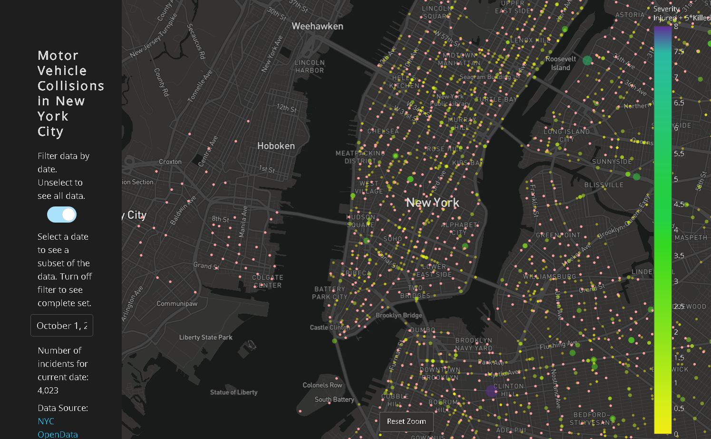

## Running
* Recommended to run docker with access to 6+ vcpu / 4+ GB memory in order to fetch the data faster
* Docker Compose is a dependency
* To run the first part, and fetch stats for a borough, edit docker-compose.yaml (change to whichever borough you want), and run:
```shell script
docker-compose up script_per_borough
```
* To run the second part, and launch a visualization of the whole dataset, run ./start.sh
### Notes
* The display is based on a plotly template found in their gallery (not from scratch)
* Your browser may have trouble loading all 1+ million data points. For this reason, it defaults to loading all incidents for a single day. Also, note that the distances from the bike share to the incident are calculated across all data points (all dates) and that we speed up their calculation by only considering points within 0.001 lon/lat of the bike share.'

## Screenshot


